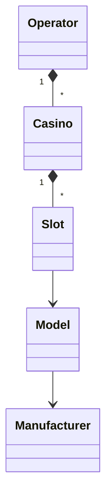

# demoCasino

## Diagrama

## Condiciones del ejercicio

Debe crear una aplicación front-end que lea el api en la colección de postman, la idea es mostrar un maestro detalle teniendo en cuenta la jerarquía que se ve en el diagrama.

También se debe mostrar los datos del usuario actual.

El api está protegido con seguridad tipo Bearer por tanto debe consultar el token una sola vez y guardar el token para las siguientes peticiones. Debe tener en cuenta que el token solo dura 2 minutos, por tanto debe gestionar el refresco del token.

El api simula tiempos de latencia altos (hasta de 5s) con posibilidad de fallos, se debe tener eso en cuenta en la experiencia del usuario.

Se debe tener en cuenta los siguientes apartados técnicos:

- Debe usar React como librería de renderizado.
- Debe gestionar el estado de la aplicación.
- La seguridad debe ser gestionada en un módulo aparte.
- Las rutas deben estar protegidas.
- Debe usar la siguiente paleta de colores:
#ECD1A5
#CE8E47
#B46C22
#843802  

## Entregable
Url de repositorio público con la solución del proyecto con las respectivas instrucciones de como ponerlo a correr.

## Evaluación

Se evaluará los siguientes apartados:

- Que el proyecto corra fácilmente.
- La estructura del proyecto.
- Las librerías que use.
- Estilo de codificación.
- Diseño de los módulos, las funciones y las clases.
- Lógica de la implementación.
- Se da un plus si crea test unitarios en el proyecto.
- Se da un plus si no usa librerías de css tipo Tailwind, Chakra, etc.
- Se da un plus si utiliza Typescript
- Se da un plus si utiliza una librería para el manejo del estado tipo redux o cualquier otro.

